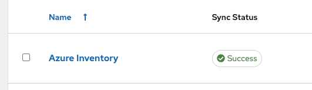

= Lab Guide: Understanding Tags for Azure Optimization
:notoc:
:toc-title: Table of Contents
:sectnums:
:icons: font

_A guide to understanding basic cloud optimization exercises, starting with dynamic inventory and resource tagging in Microsoft Azure._

---

== Lab Briefing

This section provides an overview of the lab environment and the importance of resource tagging in the cloud.

=== Lab Summary

Welcome to the Ansible Hybrid Cloud Automation - Cloud Optimization lab. In this lab, you will use Microsoft Azure as the public cloud provider. We have created an Azure account just for this lab so you can automate against a real Microsoft Azure environment with two virtual machines already running.

image:https://github.com/IPvSean/pictures_for_github/blob/master/optimization.png?raw=true[Diagram of cloud optimization, opts="border"]

=== Cloud Resources

Cloud environments are composed of numerous resources, including instances, containers, networks, and more. To effectively manage these resources, it is crucial to use **tags**. Tags are simple key-value pairs that help you organize, filter, and track your assets. There is no limit to how many tags a resource can have.

image::../assets/images/cloud_resources.png?raw=true[Various Azure cloud resources, opts="border"]

=== Example of Tags

This screenshot from the Microsoft Azure console shows a virtual machine with several tags. These tags help to quickly understand what the instance is used for, who provisioned it, who owns it, and more.

image::../assets/images/screenshot_tags.png?raw=true[Example of tags on an Azure virtual machine, opts="border"]

This concludes your lab briefing. Please move forward.
---

== Lab Guide: Hands-On Tasks

*Estimated time to complete: 10 minutes*

In this first challenge, you will learn about the pre-configured Dynamic Inventory for this lab and see how it uses tags to identify resources.

=== Task 1: Log into Automation Controller

First, you will log in to the Ansible Automation Platform to begin the lab exercises.

. **Navigate to the Ansible Automation Platform UI.**
+
Click on the **Ansible Automation Platform** tab at the top of your lab window.

. **Log in with the provided credentials.**
+
[cols="1,2a"]
|===
| Username | `admin`
| Password | `ansible123!`
|===

After logging in, you will land on the main dashboard.

=== Task 2: Examine the Dynamic Inventory

Next, you will explore the pre-configured dynamic inventory and inspect the host variables and tags that were automatically discovered from Azure.

. **Navigate to the Inventories page.**
+
To view them, Expand the `Automation Execution` menu on the left.
`Automation Execution` -> `Infrastructure` -> `Inventories`.
+

. **Select the Azure Inventory.**
+
The inventory has been created for you and synced from Azure automatically. **Click** on the inventory named `Azure Inventory`.
+

. **View the hosts.**
+
**Click** on the `Hosts` tab. You will see two hosts listed.
+
image:https://github.com/IPvSean/pictures_for_github/blob/master/inventory_hosts_tab.png?raw=true[Inventory Hosts tab, 300, opts="border"]

. **Inspect a host's variables.**
+
**Click** on one of the hosts to open its details page.
+
image::../assets/images/hosts_returned.png?raw=true[List of returned hosts, opts="border"]

. **Examine the tags.**
+
On the host's *Details* tab, find the `VARIABLES` section.
+
Scroll down to the `tags` section in the `Variables` frame to see the key-value pairs discovered from the Azure virtual machine. Take note of the tags, as you will use them in a future challenge. You can view the details in both `YAML` and `JSON` format.
+
image::../assets/images/azure_tags.png?raw=true[Azure tags in the host variables, opts="border"]
+

TIP: To see these same tags on the Azure resource, you can switch to the `Cloud(Azure)` tab at the top of your lab environment.

=== Task 3: Create a Job Template to Display Tags

Now, you will create a job template to run a playbook that retrieves and displays tag information.

. **Navigate to the Templates page.**
+
Expand the `Automation Execution` menu on the left.
`Automation Execution` -> `Templates`.

. **Create a new job template.**
+
Click the `+ Create Template` then scroll down and click `Create job template`

. **Enter the job template details.**
+
Fill out the form with the following information:
+
[cols="1,1"]
|===
| Parameter | Value
| Name | `Display tag information`
| Job Type | `Run`
| Inventory | `Azure Inventory`
| Project | `Cloud Visibility Project`
| Playbook | `playbooks/display_tags.yml`
| Execution Environment | `Microsoft Azure Execution Environment`
| Credentials | `azure_credential`
|===
+
TIP: To select the `azure_credential`, click in the text field or on the drop down icon, then select `Microsoft Azure Resource Manager`.

. **Save the job template.**
+
Scroll to the bottom, click `Create job template`.

NOTE: The Ansible Playbooks for this lab are sourced from this link:https://github.com/ansible-cloud/azure_visibility[project on GitHub].

=== Task 4: Launch the Job and Review Output

Finally, you will run the job template and examine the structured data it collects.

. **Launch the job template.**
+
Scroll to the bottom, and then `🚀 Launch template`.
+
image:https://github.com/IPvSean/pictures_for_github/blob/master/launch_job.png?raw=true[Launch Job Icon, 80, opts="border"]

. **Understand the playbook execution.**
+
This playbook runs three tasks:
+
* It uses the `azure.azcollection.azure_rm_virtualmachine_info` module to retrieve information for all virtual machines.
* The second task prints the entire JSON payload from the first task.
* The third task prints a formatted summary of the name, tags, and power state for each VM.
+
[source,yaml,role=execute]
----
- name: print tags
  ansible.builtin.debug:
    msg:
      - name: "{{ item.name }}"
      - tags: "{{ item.tags }}"
      - power_state: "{{ item.power_state }}"
  loop: "{{ retrieved_info.vms | list }}"
  loop_control:
      label: "virtual machine info and associated tags"
----

. **Review the job output.**
+
The output in the automation controller will show this structured data clearly for each resource.
+
image::../assets/images/output_tags.png?raw=true[Job output showing formatted tag data, opts="border"]

---

== Next Steps

Press the `Next` button below to proceed to the next challenge.
